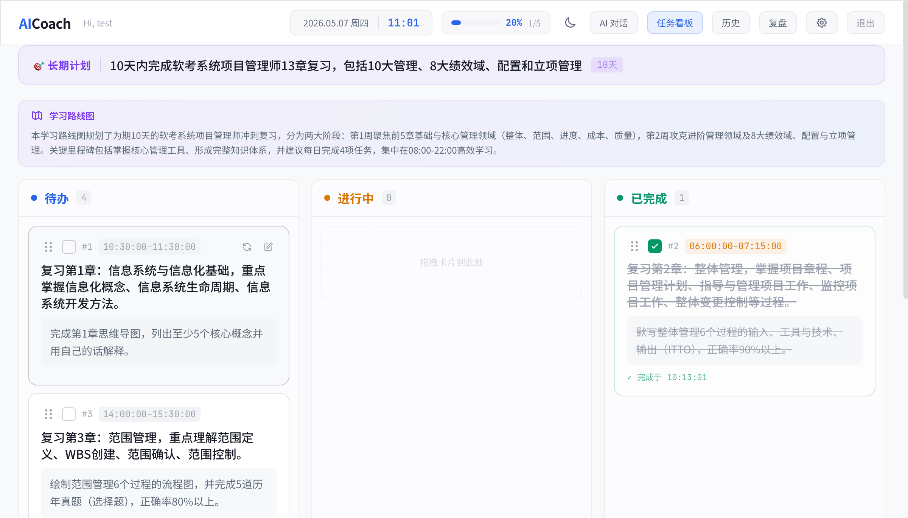

# 【Code With SOLO】我把“每天写ToDoList写到崩溃”这件事，交给了 AICoach（FastAPI + React）

标签：`Code With SOLO` `FastAPI` `React` `SQLite`

---

## 一、摘要

我用 TRAE SOLO 做了一个小工具：**AICoach（AI 执行力教练）**。它把“想做很多事”的焦虑，落到“今天就做这几件”的清单里：每条任务会写清楚完成标准，并给出建议时间段（可手动调整），还能拖拽调整顺序。  
最大的变化是：**不用操作复杂的 ToDoList 软件，也不用在聊天记录里翻计划**。我可以先和 AI 把计划聊清楚，再把它落到任务看板里，后续手动微调（必要时再让 AI 帮我微调）。

---

## 二、背景

我是一个需要长期推进学习/工作目标的独立开发者（比如 XX考试复习、XX模块开发任务）。  
我经常遇到如下三个情况：
1）早上写 ToDoList 写到快 1 个小时，下午又被会议打断。晚上再复盘 1 小时：计划很完整，执行为零。  
2）想学 XX 技能，不会拆解任务，就跟 AI 聊出一套计划。连续几天忙起来就忘了，后面越拖越不想开始。  
3）跟 AI 聊天生成了计划后，我懒得复制粘贴到日历中。过两天想翻出来，只剩去“聊天记录海底捞”。
所以我想用 SOLO 做一个简单的计划任务工具：把计划从聊天里“落地”到任务看板里，方便每天继续推进，也方便复盘。

## 三、实践过程

这一段是我用 SOLO 从“想法”做到“可用产品”的全过程。

### 3.1 我怎么拆解任务的

我把需求拆成 3 件事：

1）按照 Harness Engineering 的理念，先与 SOLO 对话把文档体系搭好：每个目录都有 `AGENTS.md` 作为导航，文档是唯一事实来源。核心文档包括：
- `docs/concepts/mvp_scope.md`：MVP 范围与成功标准
- `docs/design-docs/architecture.md`：整体架构
- `docs/design-docs/backend_design.md`：后端设计
- `docs/design-docs/frontend_design.md`：前端设计
- `docs/prompts/planner_prompt.md`、`docs/prompts/coach_prompt.md`、`docs/prompts/review_prompt.md`：核心 Prompt

2）让 SOLO 根据 `docs/` 文档生成 AICoach 的后端代码（FastAPI + SQLite）。示例 Prompt：

```text
你好！我们现在开始 AICoach MVP 阶段的正式开发。请你严格遵循代码库中的规范进行工作：

1）【阅读上下文】：
  - 请首先阅读全局入口 `AGENTS.md` 和 `docs/AGENTS.md`。
  - 仔细阅读 `docs/concepts/mvp_scope.md` 明确 MVP 边界和安全红线。
  - 仔细阅读 `docs/design-docs/architecture.md` 和 `docs/design-docs/backend_design.md`。

2）. 【当前任务：初始化后端与虚拟环境】：
   - 请在仓库根目录下创建 `backend/` 文件夹并进入。
   - 必须使用虚拟环境：请使用 `uv init` 初始化项目，并使用 `uv venv` 创建虚拟环境。
   - 使用 `uv add` 安装 `fastapi` 和 `uvicorn`，确保它们被安装到虚拟环境中，并生成 `pyproject.toml`。
   - 搭建 FastAPI + SQLite 基础骨架，包含 `main.py` 以及基础的路由结构（api/、core/、schemas/ 等）。
   - 实现一个简单的 `/health` 健康检查接口。

3）. 【工作要求】：
   - 我更喜欢“一步步来”和“实时反馈”。请不要一次性生成所有业务代码。
   - 写代码时，请加上详细的函数级注释，解释你为什么这么设计。
   - 完成基础框架搭建后，请停下来，告诉我如何使用 Mac OS 终端命令（结合 uv，确保在虚拟环境中）启动并测试这个后端。
3、让SOLO根据docs/文档，生成AICoach的frontend前端代码

### 3.2 我用到了 SOLO 哪些能力

- **多文件代码生成**：后端 FastAPI + 前端 React 一起起步
- **排查问题与迭代**：我把真实问题（刷新丢状态、重复生成、报错）直接扔给 SOLO 追根因
- **系统性加固**：把“防重复、失败可恢复、错误提示清楚、自动测试”一整套补齐

### 3.3 关键 Prompt / 操作过程（举几个我用得最爽的）

**Prompt 1：更新 UI 设计**

> frontend-design  
> 任务内容是：更新 UI 界面，类似 Trello 看板，支持拖拽调整顺序

**Prompt 2：长期计划要“跟进度推进”**

> 我已经完成第 1 章复习，明天应该推进第 2 章、第 3 章，不要重复生成第 1 章。请基于历史完成情况生成下一天任务。

**Prompt 3：刷新/重试不能重复生成**

> 刷新看板时如果存在长期任务，用弹窗引导我继续/取消/重新规划；继续按钮重复点，也不应该生成重复任务。

### 3.4 中间踩过什么坑（真实踩坑）

#### 坑 1：SOLO任务之间不具备关联性

症状：开新任务时都感觉需要通读一遍代码，才能开始干活。  
解决：让 SOLO 在阶段完成后输出“里程碑总结”，把关键设计与约束同步到下一步任务里。

#### 坑 2：解决问题要排队

症状：高峰期排队，迭代节奏被打断。  
解决：尽量把问题拆小、分批提交；必要时本地先做验证，再集中让 SOLO 处理改动。

#### 坑 3：继续任务 500（数据库唯一约束撞车）

症状：点“继续任务”直接报错。  
根因：我删除任务时，有些“关联记录”没有一起删干净，导致后面写入时发生冲突。  
解决：补齐级联删除/一致性约束，并完善“防重复生成”的幂等策略。

---

## 四、成果展示

### 4.1 最终产出（你能拿到什么）

- 一个可跑起来的网页应用：登录后就能生成计划、管理任务、复盘总结
- 看板支持拖拽、已完成按日期折叠
- 长期计划刷新引导：继续 / 取消 / 重新规划（弹窗）

### 4.2 图文展示（示意）



### 4.3 使用示例（可复制）

```bash
# 1) 启动后端
cd backend
uv sync
uv run uvicorn app.main:app --reload --host 0.0.0.0 --port 8000

# 2) 启动前端
cd ../frontend
npm install
npm run dev
```

```bash
# 注册（强密码：>=12 且包含大小写/数字/特殊符号）
curl -X POST http://localhost:8000/api/auth/register \
  -H 'Content-Type: application/x-www-form-urlencoded' \
  -d 'username=test&password=Abcdef!23456'
```

:warning: 注意：  
社区暂不支持上传视频和压缩包，如有相关内容，请用外链形式（如网盘 / 视频平台 / GitHub）。

---

## 五、效果与总结

- **提效了多少**：以前每天写/改 ToDoList 很容易 20-30 分钟起步；现在基本是“打开 → 看板直接做”，需要调整也只是改 1-2 条任务。  
- **SOLO 在流程里做了什么**：不仅生成代码，还帮我把“重复生成、状态不一致、错误不清楚”这类稳定性问题，从底层用规则与测试补齐。  
- **可复用的方法**：
  - 做 AI 产品不要只做“能生成”，还要做“能接着做、能恢复、能说明白发生了什么”
  - 任何会重复触发的动作（刷新/重试/多标签页）都要能防重复
  - 复盘必须按日期归因，否则结论会失真（两天任务混成“今天做了 8 个”）
